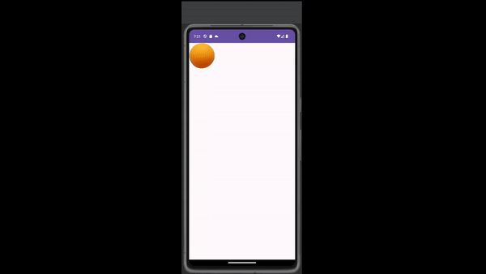

# Project 10: Gestures and Sensors

An Android app using gestures and sensors to move a ball around the screen and get location data of the current device.

## Functionality 

The following **required** functionality is completed:

* [ ] User can move the circle around the screen
* [ ] User's location and temperature are periodically updated

The following **extensions** are implemented:

* I didn't implement any extensions for this project.

## Video Walkthrough

Here's a walkthrough of implemented user stories:

LiceCap was having issues recording, so this was recorded using OBS.

## Notes

## License

    Copyright [2023] [Billy Moore]

    Licensed under the Apache License, Version 2.0 (the "License")
    you may not use this file except in compliance with the License.
    You may obtain a copy of the License at

        http://www.apache.org/licenses/LICENSE-2.0

    Unless required by applicable law or agreed to in writing, software
    distributed under the License is distributed on an "AS IS" BASIS,
    WITHOUT WARRANTIES OR CONDITIONS OF ANY KIND, either express or implied.
    See the License for the specific language governing permissions and
    limitations under the License.
